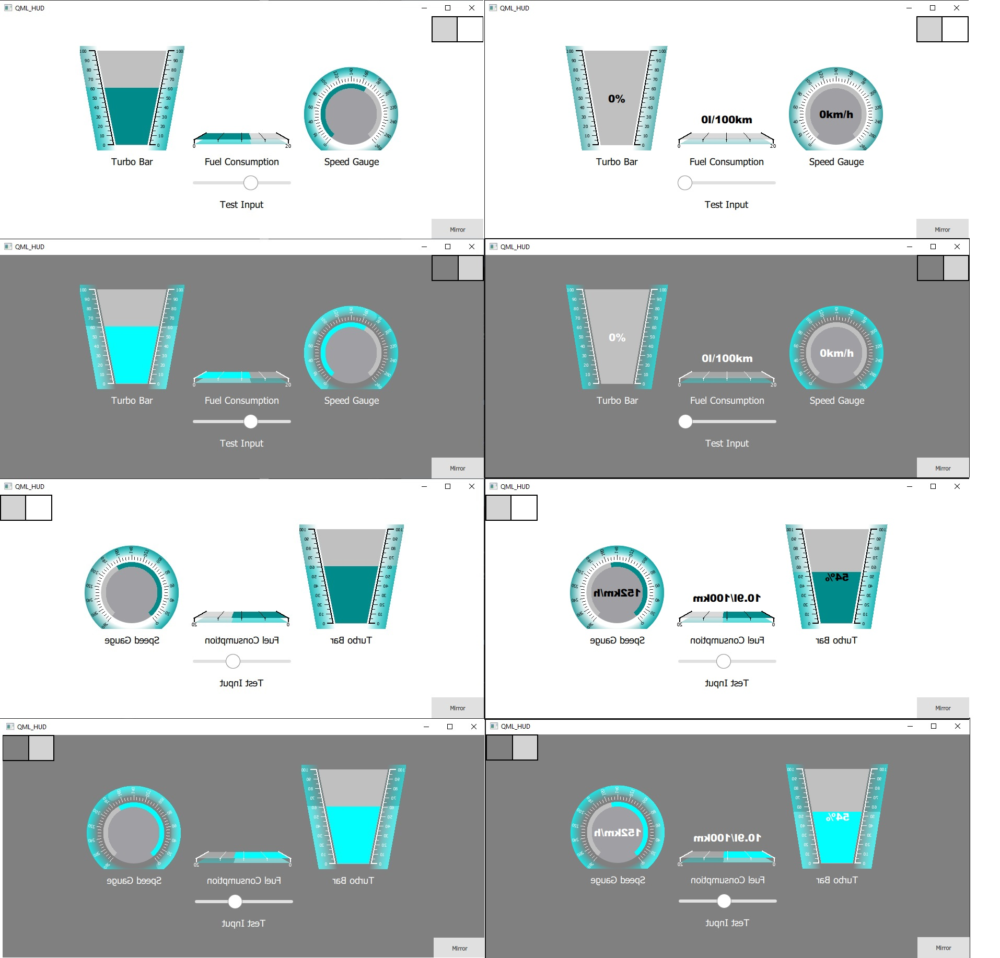

# QML_HUD

## Description
Example QML project that shows how car HUD displayed on smartphone or tabled could be designed. Elemental for this application is complex mirror view.
In proof of concept we can use slider to change value of presented gauges. In future gauges will be simulated separately from background.
In final version those values spouse to be received from outside source like from real vehicle.

## Visuals

[Day and Night Mode] Clear gauges and QML value display (not a part of C++ gauge code)

## Add your files
You can add own style like in CSS by replacing 
darkTheme.json
lightTheme.json

# QML HUD Components

## AbstractControl
Base component providing common properties for all controls.

### Properties
- `size` (real): Size of the control rectangle (both sides are equal)
- `scale` (real): Scale factor for the control view, centered. Default: 1.0
- `horizontalshift` (real): Horizontal offset of the control view in pixels
- `verticalshift` (real): Vertical offset of the control view in pixels
- `mirrorview` (bool): Enables mirroring of the control view
- `activecolor` (color): Color for the value indicator. Default: "darkCyan"
- `nonactivecolor` (color): Color for the track
- `backgroundcolor` (color): Color for the control background. Default: "darkCyan"
- `backlightcolor` (color): Color for the backlight effect. Default: "cyan"
- `dialcolor` (color): Color for the dial markings and text. Default: "black"
- `dialfontsize` (int): Font size for dial labels
- `tracktodialspacing` (int): Space between track and dial in pixels
- `minvalue` (real): Minimum possible value. Default: 0
- `maxvalue` (real): Maximum possible value
- `value` (real): Current value to display

## VerticalBar
Vertical progress indicator inheriting from AbstractControl.

### Additional Properties
- `angle` (real): Rotation angle of the bar
- `diallinewidth` (int): Width of dial lines
- `upsidedown` (bool): Flips the bar orientation

## Gauge
Circular gauge inheriting from AbstractControl.

### Additional Properties
- `boundingtotrackspacing` (int): Space between bounding box and track
- `spanangle` (real): Total angle span of the gauge
- `startangle` (real): Starting angle of the gauge
- `progresswidth` (int): Width of the progress track

## HorizontalBoard
Horizontal indicator inheriting from AbstractControl.

### Additional Properties
- `diverted` (bool): Enables diverted mode
- `dialtype` (string): Type of dial display ("full", "upper", "bottom")

## Usage
TODO:
Use examples liberally, and show the expected output if you can. It's helpful to have inline the smallest example of usage that you can demonstrate, while providing links to more sophisticated examples if they are too long to reasonably include in the README.
s to lint the code or run tests. These steps help to ensure high code quality and reduce the likelihood that the changes inadvertently break something. Having instructions for running tests is especially helpful if it requires external setup, such as starting a Selenium server for testing in a browser.

## Author
Krzysztof Chrzuszcz

## License
AGPLv3 + NC clause

## Project status
WORK IN PROGRESS