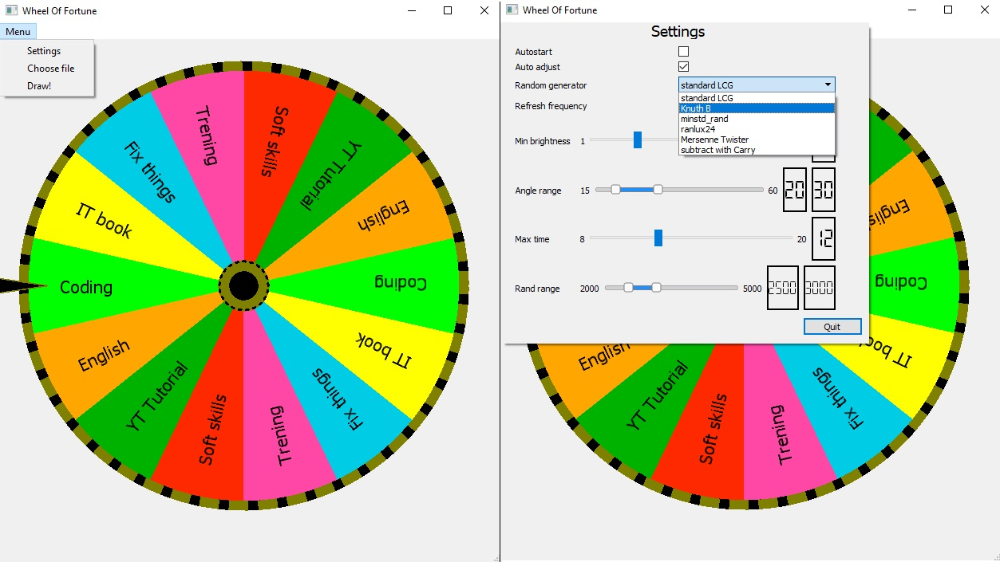

# Wheel Of Fortune

## Description
Wheel Of Fortune helps time organization or just making decision about next activity. Just by simply receiving list of options in XML format We can start lottery.

## Visuals

## Settings Description
Autostart if checked start a fortune draw just after selected file (if previous draw is finished)

Auto adjust keeps human natural level of color brightness

Random generator allows to select method to generate random data

Refresh frequency setup application view screen refreshing 

Min brightness is percentage level of color brightness to auto adjust

Angle range determinates range of possible angle of each pie piece. In consequence that allows to change how many times an option is duplicated.

Max time determinates who long we like to wait for result, BUT initial force of set in motion the wheel is drawn. So time is only limited not constant. (minimal duration is 8s)

Rand range determinates range of drawn total animation rotation angle. The result is strictly connected with it.

## Add your files
You can Add Your options to draw in folder /resources/data in XML format.
The maximum amount of options is stricty connected with minimum pie angle in settings.
The program will reject more options then 360/minAngle in single file. 
So if you will be in such situation you can decrease minAngle in settings.
Acceptable color formats are:

RGB: 

255,255,255

1.0,1.0,1.0

#FFFFFF

0xFFFFFF

RGBA: 

255,255,255,255 

1.0,1.0,1.0,1.0 

#FFFFFFFF 

0xFFFFFFFF 

And also color names from https://www.w3.org/TR/SVG11/types.html#ColorKeywords  http://fiona.dmcs.p.lodz.pl/po/qt-tutorial/docs/qt/qt.html#GlobalColor-enum (without prefix Qt::)

// Supported input RGB formating: hex (ex. #FF00FF) ; csv RGB  (ex. 255,0,255) ; by percent/factor (ex. 1.0,0.0,1.0) ; by name (ex. "Magenta")
// Please notice! CYMK, HLS, HSV, and names out of Qt basic colors enum list are not supported.

## Integrate with your tools

TODO: Instalacja Qt Framework SDK 5.9.9  ( major.minor.patch Wersjonowanie semantyczne) 

TODO: Instalacja VCPKG
TODO1

Dodanie OpenGL i freeglut w VCPKG
TODO2

Linkowanie freeglut do projektu za pomoca CMake
TODO3
https://stackoverflow.com/questions/76194764/how-to-link-a-library-installed-by-vcpkg-using-cmake

TODO4: Dodac wyjasnienie o zaleznosciach uzytych bibliotek. 4ex. #include <windows.h> w glwheeloffortune.cpp
Wersja GL dla zgodnosci z freeglut

## Usage
TODO:
Use examples liberally, and show the expected output if you can. It's helpful to have inline the smallest example of usage that you can demonstrate, while providing links to more sophisticated examples if they are too long to reasonably include in the README.

## Contributing
TODO:
State if you are open to contributions and what your requirements are for accepting them.

For people who want to make changes to your project, it's helpful to have some documentation on how to get started. Perhaps there is a script that they should run or some environment variables that they need to set. Make these steps explicit. These instructions could also be useful to your future self.

You can also document commands to lint the code or run tests. These steps help to ensure high code quality and reduce the likelihood that the changes inadvertently break something. Having instructions for running tests is especially helpful if it requires external setup, such as starting a Selenium server for testing in a browser.

## Author
Krzysztof Chrzuszcz

## License
CC BY-NC-SA

## Project status
WORK IN PROGRESS